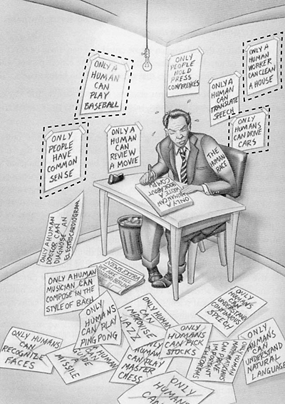
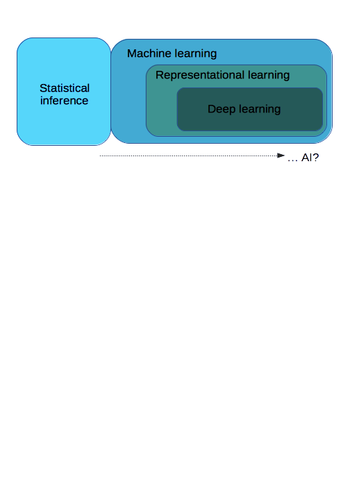
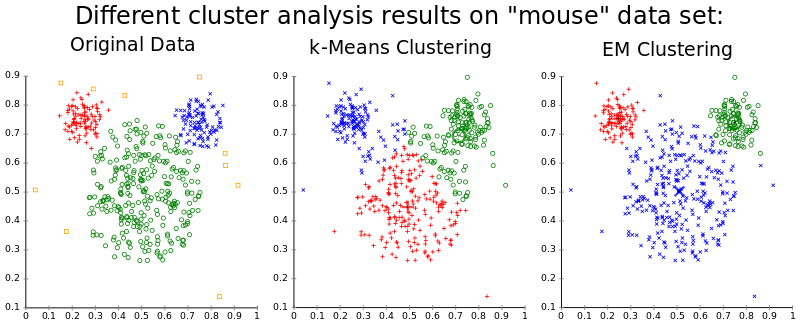
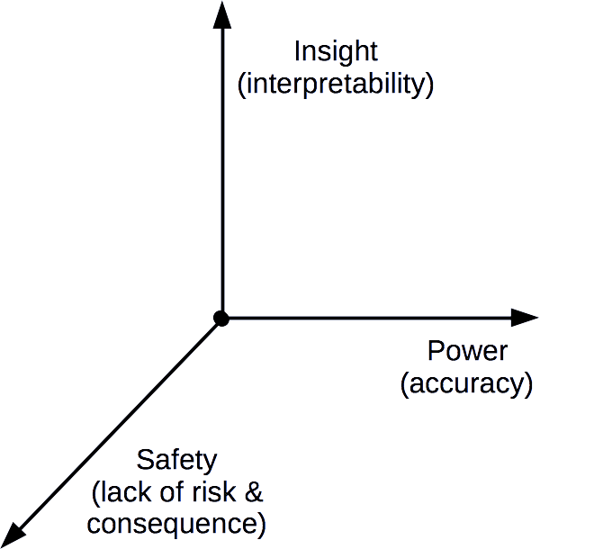

---
author:
- Paul Agapow (p.agapow@imperial.ac.uk)
institute: Data Science Institute, Imperial College London
title: Machine Learning and Cancer
subtitle: Using Big Data for insight and prediction
date: 2018/11/14

...

# What is Machine Learning?

* "a field of Artificial Intelligence"
* "(the science of) getting computers to learn and act like humans do"
* "getting computers to act without being explicitly programmed"
* "computer systems that automatically improve with experience"
* "using statistical techniques to give computer systems the ability to learn"
* "neural networks"

::: notes

* These are actual quotes

:::

# What is Machine Learning (& AI & Big Data ...)?

There's a huge amount of vague terms, ambguity and hype.

::: notes

* Necessary vocabulary blurred by:
  * indistinct terms
  * hype & marketing
  * sloppy language
  * technological progress
  * new names for old concepts
* Let's give you an intuitive feels for terms

:::

# What is Big Data?

Data *too extreme* to be handled by current approaches.

* Velocity
* Volume
* Variety
* ... Veracity
* ... ... Value

In practice, any large rich dataset.

::: notes

* When first coined, there was a clear definition: data that was too 'big' (in a broad sense) for us to work with in the ways we were used to
* Ways in which data can be 'too big': the 3 Vs, later 4 then 5.
* (Although 'value' has always seemed dubious.)
* This definition is fragile to progress:
  - Once upon a time, a megabyte of data was a lot and you might have had trouble loading it into an analysis program.
* In practice *Big Data* now tends to mean datasets that are:
  - large-ish (or could be large)
  - rich (contain multiple types of data)
  - complex (lots of relationships)
  - dirty (need lots of processing & cleaning)
  - real world (as opposed to experimental)

:::

# What is Artificial Intelligence

In practice:

* ~~a field of scientific research~~
* ~~machine learning~~
* ~~neural networks~~
* ~~deep learning~~
* more of an objective than a methodology
* computational systems that duplicates / emulates / replaces human effort
* usually involving applied statistical optimization or machine learning

::: notes

* Again a gap between formal and actual language
* There is certainly AI research and AI science but that that is not what headlines are talking about
* Generally, you don't solve or analyse problems 'using AI'
* There's no real 'AI' methodology, just methods that achieve AI

:::

# What is Machine Learning?

::: notes

* ML overlaps with traditional statistical analysis
* Deep learning (broadly neural networks) is a type of representational learning
* Representational learning is a type of learning
* AI broadly means ML, towards the deep learning end

:::

# What is Machine Learning?

|                  | **Statistical**   | **Machine**    |
|------------------|:-----------------:|:--------------:|
| **Assumptions**  | strong            | weak           |
| **Data**         | small             | large          |
| **Optimize by**  | fitting           | training       |
| **Solutions**    | "the best"        | "good enough"  |
| **Hypothesis**   | proof             | exploration    |
| **Test**         | p-values etc.     | validation     |

::: notes

* Another way to look at ML is how it is used
* ML models use relatively little prior knowledge or specifications
  - few preconceptions about how to solve this problem
  - as a consequence, need a lot of data
  - as a further consequence, ML is less about 'the' solution or 'the best' solution and more 'a solution'
  - more absolute sucess than absolute
  - hence how it's used: recommendation systems, diagnosis from radiographs, anomaly detection

:::

# Why now?

ML has come of age due to:

* Enough data
* Enough compute
* Technical progress
* Need 'good enough' solutions

# ML methods

* Many methods
* Broadly split into:
  - Unsupervised: finds structure within data
    - e.g. (most) clustering, self-organised maps, principal component analysis
  - Supervised: trained using labelled examples
    - e.g. regression, decision trees, naive bayes, neural networks
* Categories can blur
  - e.g. k-means, nearest neighbour?
* Which is better?

::: notes

* Some regard regressions and other traditional methods as ML

:::

# ML terms

* (**Train** a **model** from data)
* The model encapsulates or **generalizes** the data
* This model transforms **features** into **labels**
  - Continuous outputs (e.g. real numbers) are **regressions**
  - Discrete outputs (e.g. categories) are **classifications**
* Arguably 'non-parametric'

::: notes

* ML has it's own language
  - train: learn from
  - features: input data, covariates
  - weights: parameters
  - labels: output data, dependent variables

:::

# Machine learning: practical example

::: notes

* Cancer is disease of many subtypes
* Vital to classify cases & forecast path
* Use clinical variables & transcriptomics to train a model
* Training data labels (& model output):
  - cancer susceptibility
  - recurrence
  - survival

:::

# Unsupervised learning: clustering

A foundational issues for biology, but a lot more complicated than it seems.

::: notes

* A common, almost necessary task
* But surprisingly difficult:
  - Many algorithms
    - Disagreements on concepts (e.g. similarity)
  - Different things can cluster in different ways
  - Real data is noisy
  - What cluster "shapes" are possible
  - When do you stop splitting data
  - Can find clusters in random data
* Need to normalize data

:::

# Clustering validation

How do we assess cluster results? Validate:

* External: compare against external label or data
  - e.g. accuracy, entropy
* Internal: goodness of clustering
  - e.g. sum squared errors, cluster cohesion & seperation, silhouette
* Relative: against another clustering scheme

::: notes

:::

# Silhouette analysis

For each point:

1. Calculate the average distance to all other members of its cluster, *a*
2. For each other cluster, calculate the average distance to every member. The minimum of these is *b*
3. The silhouette width is *(b−a) / max(a,b)*

Look at distribution or average this.

::: notes

:::

# Problem: Useless solutions

The model is right but learns the wrong thing (from our point of view)

::: notes

* a.k.a.
  - gaming the specification
  - "overfitting" (eh)
  - "(implicit) bias (in training data)"  (eh)
* Examples:
  - Pictures of melanoma fix on histological ruler
  - Classifying latin music sub-genres fix on BPM
  - Grading CVs inherits misogyny of humans
  - army used ML to distinguish between camouflaged tanks and plain forest, bu the pictures of tanks were taken on cloudy day and the forest on sunny days
* Solutions:
  - Think about training data, hard
  - Broad validation
  - Interpretability

:::

# Problem: interpretability

* Reversing the model & asking "why"
* What features are important
  - Mechanistic insight
* But many ML models are tangled & horribly complex
* And ML community often uninterested
* Solutions:
  - Choose an intepretable model
  - Software that explores feature space (LIME, Lift, IML)

# Problem: how good do models have to be?

What do we want from our ML models?

::: notes

:::

 # Problem: imbalanced data
